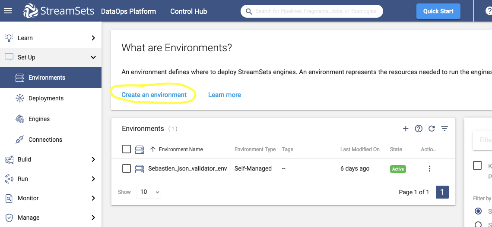
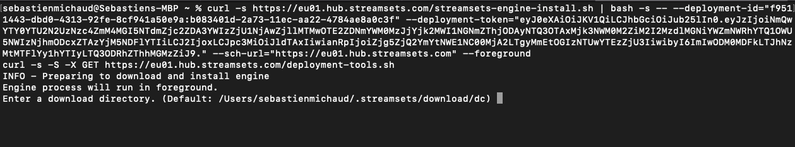

# Streamsets Json Validator Processor
A custom streamsets data collector processor based on the
[everit-org Json Schema Validator library](https://github.com/everit-org/json-schema). The Json Schema Validator library enables JSON data to be validated with a [JSON schema](https://json-schema.org).

The Json Schema Validator library relies on the [org.json or JSON-Java API](https://stleary.github.io/JSON-java/index.html) which enables the creation, manipulation and parsing of JSON data.

## Installation
The binary is available right [here](https://github.com/itsbigspark/streamsets_json_schema_validator_processor/releases/download/v1.0.0-rc.1/json_validator_1.0.zip) on this repository and can be downloaded and extracted into the user libs directory of your Streamsets Data Collector.

## Usage
### Configuration
To use the Json Validator Processor, there are two of three configuration properties that must be defined:
- The Record as JSON String config:- if checked, this config option converts the full streamsets data collector (sdc) record into the JSON string which will be validated. If unchecked, the processor will perform the validation on the field specified by the JSON String Field config option.

- The JSON String Field config:- this represents the field from the incoming sdc record that contains the 'stringified' JSON data which needs to be validated. If the specified field contains an invalid JSON string, an exception will be thrown on pipeline validation.
  

- The JSON Schema config: this allows the user to define the [draft-04](https://datatracker.ietf.org/doc/html/draft-zyp-json-schema-04), [draft-06](https://datatracker.ietf.org/doc/html/draft-wright-json-schema-01) or [draft-07](https://datatracker.ietf.org/doc/html/draft-handrews-json-schema-validation-00) JSON schema that will be used to validate the JSON data captured by the JSON String Field.


### Example Pipeline
[Insert link to blog]()

### Streamsets setup

Create a Streamsets Environment:




Click on 'Activate & Add Deployment' to add a deployment: 


Click on 'Start & Generate Install Script': 


Copy the script: 


Open a terminal, paste the script and run it:


When prompted to enter a download and installation directory, press enter to leave it as default: 




If prompted to delete and replace an existing folder, type 'Y': 


The engine will start and when it is ready, you will see the message 'Successfully connected to the Control Hub Tunneling application': 


Go back to Streamsets and click on 'Check Engine Status after running the script': 


Click on 'Create a pipeline':


Click on 'Click here to select', above 'Save & Next', to select the authoring engine: 


Select the deployment previously created: 


Continue the steps ('Save & Next'): 


Click on 'Open in Canvas': 


Go to the engine created ('my_deployment'): 


Click on the Directories tab and copy the path to the Resources Directory: 


Open a new terminal window and copy the nyc_taxi_data.csv file downloaded previously to the Resources Directory path: 


Copy the jsonvalidator downloaded previously to the user-libs directory: 


Go back to Streamsets and click on the previously created engine ('my_deployment') and Restart Engine:


The engine will restart and show 'Successfully connected to the Control Hub Tunneling application' once it has restarted: 


Open the pipeline previously created ('my_pipeline'): 


Add a Directory origin:


Under the Files tab, enter the path to the Resources Directory in the Files Directory field and the csv file name in the File Name Pattern field: 


Under the Data Format tab, select the Delimited Data Format and 'With Header Line' from the drop-down box of the Header Line field: 


Click on the expandable menu icon in the upper-right corner and search for 'json', and select the 'JSON Validator' processor from the list:


Select the Trash destination and link the processors together: 


Click on the JOSN Validator and Validator tab, and tick the 'Record as JSON String' box: 


In the JSON Schema field, enter the following schema: 

```
{
  "$schema": "http://json-schema.org/draft-07/schema#",
  "title": "NYC taxi data schema",
  "description": "An nyc taxi data record",
  "type": "object",
  "properties": {
    "medallion": {
      "description": "The unique identifier for a record",
      "type": "string"
    },
    "hack_license": {
      "description": "A taxi driver's license number",
      "type": "string"
    },
    "fare_amount": {
      "type": "number",
      "minimum": 1
    }
  },
  "required": [
    "medallion","hack_license","vendor_id","payment_type","fare_amount","surcharge",
    "mta_tax","tip_amount","tolls_amount","total_amount","rate_code","pickup_datetime",
    "dropoff_datetime","passenger_count","trip_time_in_secs","trip_distance","pickup_longitude",
    "pickup_latitude","dropoff_longitude","dropoff_latitude","credit_card"
  ]
}
```

Click on Test Run in the upper-right-hand corner and on 'Reset Origin & Start':


The Realtime Summary will show the errors (5386 records inputted and 5386 errors): 

 

Click on the JSON Validator processor, then Errors to see the Error Records, which show that the errors are due to the JSON schema defined expecting the fare_amount field from the record to be a number, but the value turned out to be a string: 


To fix this, stop the test run by clicking on the red square in the top-right: 


Click on the JSON Validator processor and Validator tab, and change the type of the fare_amount field to string:


Restart the pipeline from origin:


This time there will be no errors because the type of the fare_amount field from the records matches there type (string) from the .csv file: 


Blog: [bigspark blog](https://bigspark.dev/blog)

## Credits
### Authors
* [Joel Klo](https://github.com/joeykay9)
* [Shaine Ismail](https://github.com/shainnif)

### Helpful links
* [Introduction to JSON Schema in Java](https://www.baeldung.com/introduction-to-json-schema-in-java)
* [Introduction to JSON-Java (org.json)](https://www.baeldung.com/java-org-json)

## License
This project is licensed with the [Apache License 2.0](https://github.com/itsbigspark/streamsets_json_schema_validator_processor/blob/develop/LICENSE).
